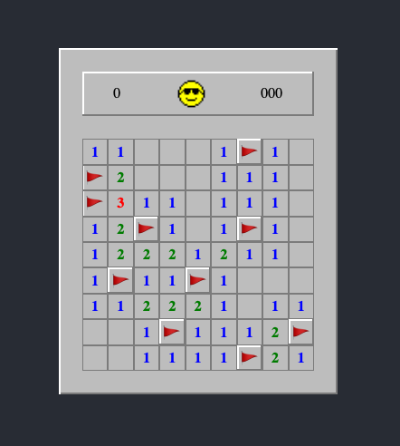

# minesweeper
The classic DOS game built with React.

[Play here: ](https://pennrosen.github.io/react-minesweeper)

---

### TODO

- [ ] Choose between three different difficulty levels.
- [ ] Timer.
- [ ] Mines left.
- [ ] Set flags with right click.
- [ ] Quick mode.
- [ ] Settings save in cookie.
- [ ] Generate non-guessing game.
- [ ] Record high score.
- [ ] First click never reveals a mine.
- [ ] Mobile friendly.
- [ ] Write some tests.

### License
[MIT](./LICENSE)
